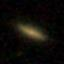
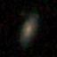
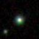
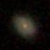
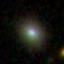
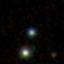
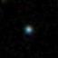
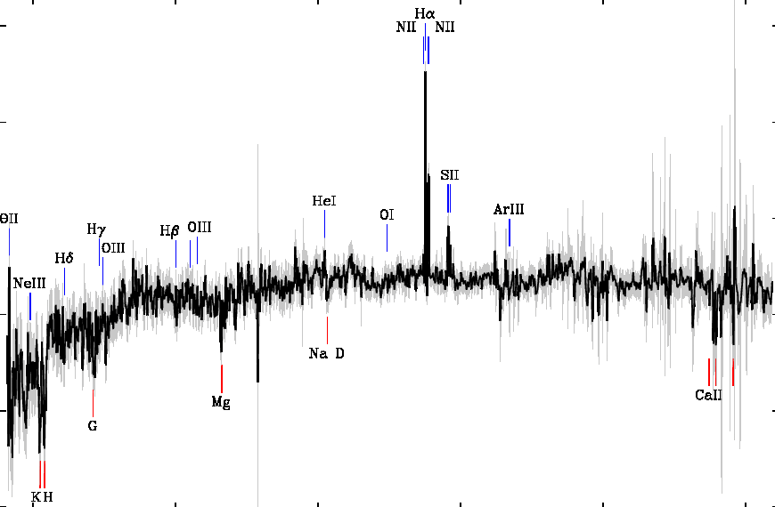
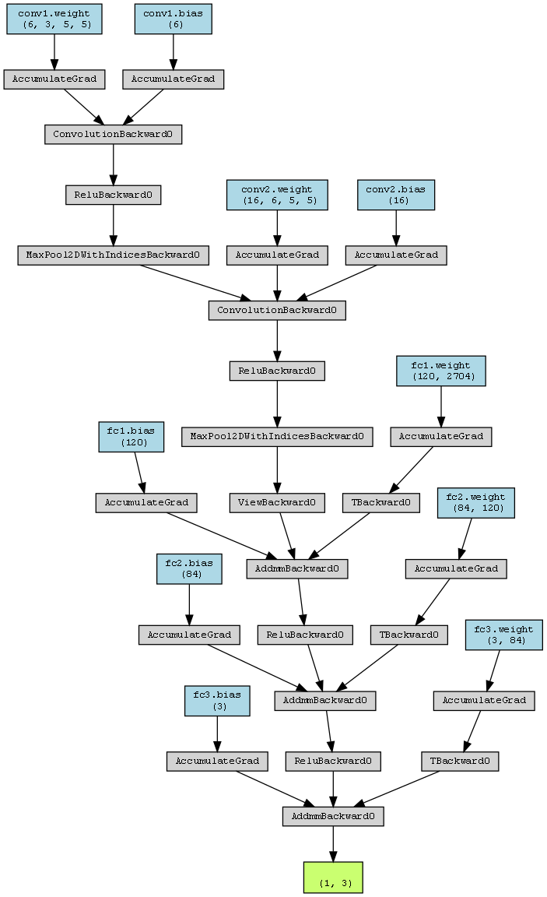

```{r setup, include=FALSE}
knitr::opts_chunk$set(warning = F, message = F, echo = F,
                      fig.height = 4)
```

# Astronomical Challange 
Our research focuses on classifying celestial objects into stars, galaxies or quasars using their spectral characteristics. With the advancement of astronomical technology, we can obtain a large amount of data, including images and spectral information, from telescopes and large-scale photometry.

The central question of our research is: "How can we effectively use image and spectral data to accurately classify different types of stellar objects?"


# Data
We plan to work with the astronomy dataset containing three types of data: 

\quad  \quad  \quad  \quad  

\quad  \quad  \quad  \quad 

\centering

Figure 1: Image of the celestial objects

\raggedright

\quad {width=45%}

\centering

Figure 2: Image of the spectra of the celestial objects

\raggedright

```{r results='asis'}
library(ggthemes)
library(tidyverse)
library(kableExtra)
library(VIM)
df = read.csv("./data/metadata/clean_data.csv")[, -20]

vars = colnames(df)
explanations = c("Object Identifier",
                 "Right Ascension angle (at J2000 epoch)",
                 "Declination angle (at J2000 epoch)",
                 "Ultraviolet filter",
                 "Green filter",
                 "Red filter",
                 "Near Infrared filter",
                 "Infrared filter",
                 "Run Number",
                 "Rerun Number",
                 "Camera column",
                 "Field number",
                 "Unique ID used for optical spectroscopic objects",
                 "Object class",
                 "Redshift value based on the increase in wavelength",
                 "Plate",
                 "Modified Julian Date",
                 "fiber ID",
                 "Plate ID")

tab_exp = data.frame(vars, explanations)
mytheme <- theme(plot.title=element_text(face="bold.italic",
                                         size="14", color="brown"),
                 axis.title=element_text(face="bold.italic",
                                         size=10, color="brown"),
                 axis.text=element_text(face="bold", size=9,
                                        color="darkblue"),
                 panel.background=element_rect(fill="white",
                                               color="darkblue"),
                 panel.grid.major.y=element_line(color="grey",
                                                 linetype=1),
                 panel.grid.minor.y=element_line(color="grey",
                                                 linetype=2),
                 panel.grid.minor.x=element_blank(),
                 legend.position="right") 


names(tab_exp) <- sapply(names(tab_exp), function(x) paste0("\\textbf{\\normalsize ", x, "}"))

kable(tab_exp, format = "latex", 
      booktabs = TRUE,
      escape = F,
      caption = "Metadata of the celestial objects") %>%
  kable_styling(full_width = F, position = "left", font_size = 8)
```

They can be found in this [*\textcolor{blue}{link}*](https://github.com/siriuszza/stat679final/tree/main/data). All the data is obtained from https://www.sdss.org. Moreover, the distribution of classes of the celestial objects is 33333 samples each, which is selected from the website to make sure the dataset is balanced. 

# EDA
First we will check and deal with missing values in the dataset. There are 1 missing value for **i** and 3 for **z**. Then from Figure 1, we can see that **i** and **z** are quite scattered. So, we use regression imputation to impute the missing values.

Next, we give several visualizations to better understand the data. Figure 2 gives the spread of the celestial objects (galaxies, quasars, stars) across the universe. The x-axis is right ascension angle (at J2000 epoch), and the y-axis is declination angle (at J2000 epoch). We can see some interesting patterns, but it is unclear for classification.

Figure 3 gives the correlationship between varibales. There are some variables that have strong correlationships.

```{r fig.cap="Boxplot"}
df_org = read.csv("./data/metadata/org_metadata.csv")
df_org[df_org == -9999] = NA
df_long = gather(df_org, key = "variable", value = "value", u, g, r, i, z, redshift) 

ggplot(df_long, aes(x = variable, y = value, col = class)) +
  geom_boxplot(alpha = 0.5) +
  labs(x = "Variable", y = "Value")+mytheme
```

\newpage

```{r fig.cap="Spread of Stellars"}
ggplot(df) +
  geom_point(aes(x = ra, y = dec, color = class),
             alpha = 0.025) + 
  labs(x = "Right Ascension",
       y = "Declination")+
  guides(color = guide_legend(override.aes = list(alpha = 1))) + mytheme
```

```{r fig.cap="Correlation", fig.height=6}
library(corrplot)
corr = cor(df %>% select(-rerun))
corrplot(corr)
```

# Methods
For our three types of data, we intend to use three seperate methods to build three different classification models. Then, we plan to use a voting classifier to combine three models and give our final model.

In this section, we will give brief introduction to the methods.

## kNN

## Decision Tree

## CNN
Before we get into complex Neural Networks, we firstly try to use a simple CNN to test the performance of NN in this problem. This CNN is quit shallow (337k parameters) with two convolutional layers and a maxpooling in between and followed by three fully connected layers. The competitor is VGG16 which is a much deeper NN with 13 convoluntional layers and 3 fully connected layers (138million parameters).

\quad {width=45%}

\centering

Figure 4: Structure of CNN

\raggedright


```{r}

```

## Voting Classifier


# Results
## Metadata

Regarding statistical models, we intend to use either classification trees, or KNN models, incorporating ensemble learning methods such as bagging or boosting to improve performance. Our ultimate goal is to develop a hybrid model that combines image classifiers with meta-classifiers, aiming for superior accuracy.

```{r}
df_loges = df %>% select(u, g, r, i, z,
                         redshift,
                         class)
```

```{r}
library(caret)

trainData <- read.csv("./data/metadata/train_metadata.csv")
testData <- read.csv("./data/metadata/test_metadata.csv")

library(rpart)

treeModel <- rpart(class ~ ., data = trainData, method = "class")
predTree <- predict(treeModel, testData, type = "class")
cm_tree <- confusionMatrix(predTree, as.factor(testData$class))
cm_table <- as.table(cm_tree$table)
cm_df <- as.data.frame(cm_table)
colnames(cm_df) <- c('Reference', 'Prediction', 'Freq')

p1 <- ggplot(cm_df, aes(x = Reference, y = Prediction, fill = Freq)) +
  geom_tile(color = "white") +
  scale_fill_gradient(low = "white", high = "blue") +
  geom_text(aes(label = Freq), vjust = 1) +
  labs(title = "Confusion Matrix of Tree", x = "Actual Class", y = "Predicted Class") +
  mytheme
```

```{r fig.cap='Confusion Matrix'}
library(class)
trainDataScaled <- scale(trainData[,-7]) # Assuming 'class' is the last column
testDataScaled <- scale(testData[,-7], 
                        center = attr(trainDataScaled, "scaled:center"), scale = attr(trainDataScaled, "scaled:scale"))

knnModel <- knn(train = trainDataScaled, test = testDataScaled, cl = trainData$class, k = 3)

cm_knn <- confusionMatrix(knnModel, as.factor(testData$class))
cm_table <- as.table(cm_knn$table)
cm_df <- as.data.frame(cm_table)
colnames(cm_df) <- c('Reference', 'Prediction', 'Freq')

p2 <- ggplot(cm_df, aes(x = Reference, y = Prediction, fill = Freq)) +
  geom_tile(color = "white") +
  scale_fill_gradient(low = "white", high = "blue") +
  geom_text(aes(label = Freq), vjust = 1) +
  labs(title = "Confusion Matrix of KNN", x = "Actual Class", y = "Predicted Class") +
  mytheme

gridExtra::grid.arrange(p1,p2,nrow=2)

sum(knnModel == testData$class) / nrow(testData)
```


```{r results='asis'}
# Extract statistics from confusion matrix
stats_tree <- cm_tree$overall
stats_knn <- cm_knn$overall
# Convert to dataframe
stats_df <- data.frame(Statistic = names(stats_tree), Tree = as.vector(stats_tree),KNN = as.vector(stats_knn))

# Render table with knitr::kable()
kable(stats_df,
      format = "latex", 
      booktabs = TRUE,
      escape = F,
      caption = "Statistics from Confusion Matrix", 
      digits = 5) %>%
  kable_styling(full_width = F, position = "center", font_size = 8)

```

From the confusion matrix and statistics, we see a success in building model through the numerical data. By using several index and the red shift, our simple models reach more than 96% accuracy on validation data.

## Image of the celestial objects
The results of this simple CNN is quite good. The cross entropy loss drop quickly after 10k iterations and get stable around 0.27. And the robustness can also be seen on its 90.2%(SGD)91.8%(Adam) average accuracy after 10 epochs training on validation data. Which actually discourages us to apply deeper NN which is quite time and energy consuming. 
The training took 20 min and the cross entropy loss is under 0.2 after 3 epochs training and stable at 0.18. On the validation data set, VGG has 94.23% which is better than our simple CNN. However this high accuracy not only consume lot of time but also make it more difficult to improve the performance through the combination of models.
With these facts, we plan to modify the simple CNN a little without changing its main structure, and use this simple CNN to build up a final model which is expected to have similar performance as VGG16 while consume less time. 

```{r fig.cap='loss curves'}
library(ggplot2)
library(dplyr)

# Manually create a data frame for Simple CNN and VGG16 losses
# Assuming each 'block' is 200 iterations
simple_cnn <- data.frame(
  Model = "Simple CNN",
  Iteration = 1:60,
  Loss = c(1.094, 1.015, 0.678, 0.615, 0.595, 0.541, 0.444, 0.366, 0.357, 0.350, 
            0.338, 0.338, 0.346, 0.327, 0.301, 0.319, 0.301, 0.307, 0.297, 0.286,
            0.299, 0.285, 0.285, 0.277, 0.279, 0.270, 0.274, 0.277, 0.269, 0.266,
            0.258, 0.258, 0.260, 0.261, 0.259, 0.264, 0.262, 0.248, 0.247, 0.241,
            0.252, 0.245, 0.247, 0.249, 0.240, 0.245, 0.240, 0.237, 0.233, 0.244,
            0.241, 0.243, 0.234, 0.225, 0.230, 0.238, 0.222, 0.226, 0.239, 0.237)
)

vgg16 <- data.frame(
  Model = "VGG16",
  Iteration = 1:30,
  Loss = c(0.997, 0.313, 0.245, 0.257, 0.229, 0.219, 0.249, 0.207, 0.204, 0.243,
            0.207, 0.201, 0.218, 0.188, 0.194, 0.219, 0.185, 0.180, 0.204, 0.184,
            0.181, 0.204, 0.178, 0.222, 0.216, 0.189, 0.179, 0.208, 0.171, 0.176)
)

SimpleCNN_SGD_spec <- data.frame(
  Model = "SimpleCNN_SGD_spec",
  Iteration = 1:50,
  Loss = c(1.086, 0.778, 0.307, 0.232, 0.192, 
                 0.151, 0.131, 0.124, 0.105, 0.100, 
                 0.088, 0.075, 0.072, 0.069, 0.067, 
                 0.056, 0.059, 0.052, 0.049, 0.048, 
                 0.045, 0.040, 0.046, 0.041, 0.039, 
                 0.037, 0.037, 0.037, 0.033, 0.030, 
                 0.032, 0.030, 0.031, 0.032, 0.025, 
                 0.026, 0.026, 0.025, 0.027, 0.025, 
                 0.022, 0.024, 0.027, 0.023, 0.018, 
                 0.021, 0.017, 0.020, 0.020, 0.021)
)

# Combine the two datasets
loss_data <- rbind(simple_cnn, vgg16)

# Now plot using ggplot2
ggplot(loss_data, aes(x = Iteration, y = Loss, color = Model)) + 
  geom_line() + 
  geom_smooth(se = FALSE, method = "loess") +  # Smoothed line
  theme_minimal() +
  labs(title = "Loss Curves", x = "Iteration", y = "Loss", color = "Model") +
  mytheme
```

```{r}
simple_cnn_0.9 <- data.frame(
  Model = "Simple CNN 0.9",
  Iteration = 1:60,
  Loss = c(1.094, 1.015, 0.678, 0.615, 0.595, 0.541, 0.444, 0.366, 0.357, 0.350, 
            0.338, 0.338, 0.346, 0.327, 0.301, 0.319, 0.301, 0.307, 0.297, 0.286,
            0.299, 0.285, 0.285, 0.277, 0.279, 0.270, 0.274, 0.277, 0.269, 0.266,
            0.258, 0.258, 0.260, 0.261, 0.259, 0.264, 0.262, 0.248, 0.247, 0.241,
            0.252, 0.245, 0.247, 0.249, 0.240, 0.245, 0.240, 0.237, 0.233, 0.244,
            0.241, 0.243, 0.234, 0.225, 0.230, 0.238, 0.222, 0.226, 0.239, 0.237)
)

simple_cnn_0.99 <- data.frame(
  Model = "Simple CNN 0.99",
  Iteration = 1:60,
  Loss = c(
    1.066, 0.681, 0.574, 0.424, 0.365, 0.354,
    0.320, 0.296, 0.299, 0.288, 0.268, 0.268,
    0.247, 0.251, 0.246, 0.246, 0.243, 0.248,
    0.232, 0.219, 0.226, 0.219, 0.224, 0.227,
    0.214, 0.212, 0.219, 0.221, 0.204, 0.202,
    0.206, 0.213, 0.214, 0.213, 0.202, 0.205,
    0.197, 0.203, 0.199, 0.231, 0.202, 0.199,
    0.204, 0.190, 0.187, 0.199, 0.196, 0.199,
    0.190, 0.184, 0.189, 0.176, 0.198, 0.189,
    0.173, 0.179, 0.184, 0.182, 0.179, 0.180
))

simple_cnn_0.95 <- data.frame(
  Model = "Simple CNN 0.95",
  Iteration = 1:60,
  Loss = c(
    1.048, 0.680, 0.632, 0.597, 0.592, 0.520,
    0.371, 0.354, 0.341, 0.355, 0.339, 0.349,
    0.330, 0.331, 0.309, 0.320, 0.300, 0.293,
    0.287, 0.272, 0.275, 0.279, 0.264, 0.277,
    0.257, 0.258, 0.253, 0.259, 0.250, 0.246,
    0.238, 0.256, 0.251, 0.237, 0.248, 0.235,
    0.240, 0.234, 0.240, 0.235, 0.232, 0.244,
    0.232, 0.227, 0.224, 0.232, 0.235, 0.241,
    0.234, 0.216, 0.224, 0.222, 0.227, 0.234,
    0.229, 0.222, 0.221, 0.218, 0.228, 0.214
))

simple_cnn_adam <- data.frame(
  Model = "Simple CNN adam",
  Iteration = 1:60,
  Loss = c(
    0.479, 0.337, 0.329, 0.303, 0.282, 0.280,
    0.257, 0.254, 0.251, 0.246, 0.239, 0.234,
    0.225, 0.225, 0.225, 0.219, 0.215, 0.226,
    0.214, 0.200, 0.211, 0.227, 0.217, 0.211,
    0.198, 0.208, 0.192, 0.201, 0.200, 0.201,
    0.196, 0.196, 0.185, 0.185, 0.189, 0.186,
    0.179, 0.179, 0.179, 0.180, 0.187, 0.174,
    0.169, 0.159, 0.184, 0.180, 0.164, 0.175,
    0.168, 0.158, 0.163, 0.169, 0.166, 0.166,
    0.155, 0.158, 0.163, 0.161, 0.162, 0.150
))

CNN_select_table <- data.frame(
  Name = c("SimpleCNN","VGG16","Res18"),
  Accuracy = c("91.68%","94.11%","94.89%"),
  train_time = c("635","1281","1324")
)

SimpleCNN_comp <- data.frame(
  Optimizer = c("SGD_mom0.9","SGD_mom0.95","SGD_mom0.99","Adam"),
  Accuray = c("91.68%","92.84%","93.78%","93.91%"),
  train_time = c("458","463","462","463")
)

knitr::kable(t(CNN_select_table), format = "markdown", caption = "CNN comparison",)
knitr::kable(t(SimpleCNN_comp), format = "markdown", caption = "CNN tuning  comparison",)
loss_data <- rbind(simple_cnn_0.9, simple_cnn_0.95,simple_cnn_0.99,simple_cnn_adam)

# Now plot using ggplot2
ggplot(loss_data, aes(x = Iteration, y = Loss, color = Model)) + 
  geom_line() + 
  geom_smooth(se = FALSE, method = "loess") +  # Smoothed line
  theme_minimal() +
  labs(title = "Loss Curves", x = "Iteration", y = "Loss", color = "Model") +
  mytheme
```

## Image of the spectra

## Voting Classifier

# Conclusion

The voting classifier 


