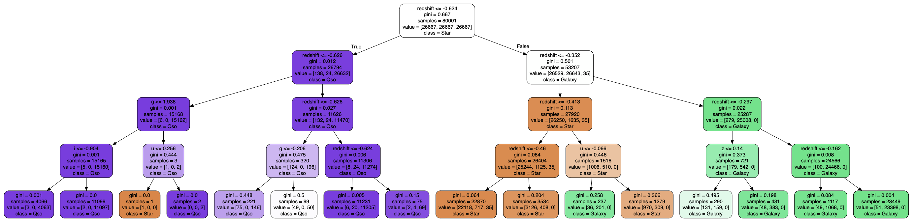

```{r setup, include=FALSE}
knitr::opts_chunk$set(echo = FALSE,
                      message = F,
                      warning = F)
library(reticulate)
```

```{r}
library(ggthemes)
library(tidyverse)
library(kableExtra)

mytheme <- theme(plot.title=element_text(face="bold.italic",
                                         size="14", color="brown"),
                 axis.title=element_text(face="bold.italic",
                                         size=10, color="brown"),
                 axis.text=element_text(face="bold", size=9,
                                        color="darkblue"),
                 panel.background=element_rect(fill="white",
                                               color="darkblue"),
                 panel.grid.major.y=element_line(color="grey",
                                                 linetype=1),
                 panel.grid.minor.y=element_line(color="grey",
                                                 linetype=2),
                 panel.grid.minor.x=element_blank(),
                 legend.position="right") 
```


## Outline

\tableofcontents

# Astronomical Challenge
Classifying celestial objects into stars, galaxies or quasars.

\begin{columns}[T] 

\begin{column}{0.4\textwidth}
  \includegraphics[width=1\textwidth]{./images/intro.png}
\end{column}

\begin{column}{0.6\textwidth} 
\begin{itemize}
\item Stars: a luminous sphere of plasma held together by its own gravity.
\item Galaxy: a massive, gravitationally bound system that consists of stars, stellar remnants, interstellar gas, dust, and dark matter.
\item Quasars: a very energetic and distant active galactic nucleus, with its energy output sometimes surpassing that of the rest of the galaxy combined. 
\end{itemize}

\end{column}

\end{columns}

<!-- \begin{center} -->
<!--   \includegraphics[width=0.5\textwidth]{./images/intro.png} -->
<!-- \end{center} -->

## Idea

\begin{itemize}
\item There are a lot of classification models: KNN,Tree,Logistic Regression, Neural Networks
\item Different models may perform differently on same data
\item Can we combine them together to make more accurate classification?
\item Voting Classifier
\end{itemize}

# Data & Preprocessing
## Images

\begin{figure}
\centering
\begin{minipage}{0.3\textwidth}
\centering
\includegraphics[width=\linewidth]{../data/GALAXY/GALAXY_1.jpg}
\caption{Galaxy}
\end{minipage}\hfill
\begin{minipage}{0.3\textwidth}
\centering
\includegraphics[width=\linewidth]{../data/STAR/STAR_1.jpg}
\caption{Star}
\end{minipage}\hfill
\begin{minipage}{0.3\textwidth}
\centering
\includegraphics[width=\linewidth]{../data/QSO/QSO_1.jpg}
\caption{Qusar}
\end{minipage}
\end{figure}

\begin{figure}
\centering
\begin{minipage}{0.3\textwidth}
\centering
\includegraphics[width=\linewidth]{../data/GALAXY_spec/GALAXY_spectrum_1.jpg}
\caption{Galaxy Spec}
\end{minipage}\hfill
\begin{minipage}{0.3\textwidth}
\centering
\includegraphics[width=\linewidth]{../data/STAR_spec/STAR_spectrum_1.jpg}
\caption{Star Spec}
\end{minipage}\hfill
\begin{minipage}{0.3\textwidth}
\centering
\includegraphics[width=\linewidth]{../data/QSO_spec/QSO_spectrum_1.jpg}
\caption{Qusar Spec}
\end{minipage}
\end{figure}


## Metadata
```{r results='asis'}
df = read.csv("../data/metadata/clean_data.csv")[,-20]
vars = colnames(df)[c(-1, -18, -19)]
explanations = c("Right Ascension angle (at J2000 epoch)",
                 "Declination angle (at J2000 epoch)",
                 "Ultraviolet filter",
                 "Green filter",
                 "Red filter",
                 "Near Infrared filter",
                 "Infrared filter",
                 "Run Number",
                 "Rerun Number",
                 "Camera column",
                 "Field number",
                 "Unique ID used for optical spectroscopic objects",
                 "Object class",
                 "Redshift value based on the increase in wavelength",
                 "Plate",
                 "Modified Julian Date")

tab_exp = data.frame(vars, explanations)

kable(tab_exp, format = "latex", 
      booktabs = TRUE,
      caption = "Metadata of the celestial objects") %>%
  kable_styling(full_width = F, position = "center", font_size = 7)
```

## EDA
- Missing Values:
  - Metadata: 3, Regression Imputation
  - Image of Spectra: 14115
  
- Samples for each category: 33333

- Correlationship

```{r fig.height=3, fig.cap="Correlationship of Variables"}
library(corrplot)
corr = cor(df %>% select(-rerun))
corrplot(corr)
```


# Methodology
## Meta Data
- **Explanatory Variables**: u, g, r, i, z, redshift

- **Response Variable**: class
  - GALAXY: 0
  - QSO: 1
  - STAR: 2

- **kNN**: k = 3

- **Decision Tree**:
  - Gini impurity
  - max_depth: 4

- **Logistic Regression**
  - C: 1
  - penalty: l2
  - $P(Y_i = k) = \frac{e^{\beta_k \cdot X_i}}{\sum_{j = 1}^3 e^{\beta_j \cdot X_i}}$, $i = 0, 1, 2$

## Images

\begin{columns}[T] 

\begin{column}{0.5\textwidth}
\includegraphics[width=0.8\textwidth]{../data/simple_cnn_visualization.png}
\end{column}

\begin{column}{0.5\textwidth} 
\begin{itemize}
\item Structure:
\begin{itemize}
\item 2 layers of convolution and 1 maxpooling
\item 3 layers of full connecting 
\end{itemize}

\item Output: 
\begin{itemize}
\item \(\vec{y}=(y_1,y_2,y_3)\) 
\item \(y_{pred}=argmax_i\{\vec y\}\)
\item Probability through softmax \(P(y = j \mid \mathbf{z}) = \frac{e^{z_j}}{\sum_{k=1}^3 e^{z_k}}\)
\end{itemize}

\item Training:  

SGD with different momentum, Adam, 10 epoch, batch size 64,lr 0.001

\end{itemize}

\end{column}

\end{columns}


## Voting Classifier
\begin{columns}[T] 

\begin{column}{0.4\textwidth}
\includegraphics[width=0.8\textwidth]{./images/voting.png}
\end{column}

\begin{column}{0.6\textwidth} 
\begin{itemize}
\item Soft Voting:
\begin{itemize}
\item Models \(\{C_1,\cdots C_n\}\) 
\item For a given inputs, \(C_i\) has a predict probability\(P_i(y_j | x)\) 
\item The probabilities for voting classifier \(P(y_j | x) = \frac{1}{m} \sum_{i=1}^m P_i(y_j | x)\)
\item The prediction \( p(x) = \arg \max_{y_j} P(y_j | x)\)
\end{itemize}

\end{itemize}

\end{column}

\end{columns}

\begin{itemize}
\item Weighted Hard Voting:
For a given inputs, \(C_i\) has a predict \(y^{i}|x:y^{i}_{k=j}=1,y^{i}_{k\neq j}=0\)  \(y_{pred}=\sum_i w_i\cdot y^{i}|x\), here we use accuracy of each model as their weight, the predict class is \(argmax_j~y_{pred}\)
\item Construction:  

The candidate models are KNN, Logistic Regression, Decision Tree, CNN for celestial objects image and CNN for spectrum image.

\end{itemize}


# Results
## Metadata
```{python results='hide'}
from sklearn.ensemble import VotingClassifier

from sklearn.neighbors import KNeighborsClassifier
from sklearn.tree import DecisionTreeClassifier, export_text
from sklearn.linear_model import LogisticRegression

from sklearn.model_selection import train_test_split
from sklearn.metrics import accuracy_score

from sklearn import preprocessing
import pandas as pd

# Load dataset
df_train = pd.read_csv("../data/metadata/train_metadata.csv")
df_test = pd.read_csv("../data/metadata/test_metadata.csv")
X_train, y_train = df_train.iloc[:, 0:6], df_train["class"]

X_test, y_test = df_test.iloc[:, 0:6], df_test["class"]

scaler = preprocessing.StandardScaler().fit(X_train)
X_train = scaler.transform(X_train)
X_test = scaler.transform(X_test)

# Instantiate the individual classifiers
knn_clf = KNeighborsClassifier(n_neighbors = 3)
tree_clf = DecisionTreeClassifier(max_depth = 4)
lr_clf = LogisticRegression(multi_class='multinomial', 
solver='lbfgs', max_iter=2000,
penalty='l2', C = 1)


knn_clf.fit(X_train, y_train)
tree_clf.fit(X_train, y_train)
lr_clf.fit(X_train, y_train)

knn_pred = knn_clf.predict(X_test)
tree_pred = tree_clf.predict(X_test)
lr_pred = lr_clf.predict(X_test)
```


```{python results='hide'}
# LR
coef = lr_clf.coef_
intercept = lr_clf.intercept_
```

- Decision Tree:


- Logistic Regression:
```{r}
library(caret)
trainData <- read.csv("../data/metadata/train_metadata.csv")
testData <- read.csv("../data/metadata/test_metadata.csv")
```

```{r results='asis'}
lr_coef = cbind(py$intercept, py$coef)
colnames(lr_coef) = c("Intercept", colnames(testData)[-7])
rownames(lr_coef) = c("Galaxy", "Qso", "Star")

kable(lr_coef, format = "latex", 
      booktabs = TRUE,
      row.names = T,
      caption = "Coefficients of Logistic Regression") %>%
  kable_styling(full_width = F, position = "center", font_size = 7)
```

## Metadata

\begin{itemize}
\item The accuracy of KNN: 96.80\%, Tree: 97.44\%, Logistic Regression: 97.00\%
\item Soft voting: 97.75\%, Hard voting: 97.55\%
\end{itemize}

```{r}
cm_tree <- confusionMatrix(as.factor(py$tree_pred), as.factor(testData$class))
cm_table <- as.table(cm_tree$table)
cm_df <- as.data.frame(cm_table)
colnames(cm_df) <- c('Reference', 'Prediction', 'Freq')

p1 <- ggplot(cm_df, aes(x = Reference, y = Prediction, fill = Freq)) +
  geom_tile(color = "white") +
  scale_fill_gradient(low = "white", high = "royalblue") +
  geom_text(aes(label = Freq), vjust = 1) +
  labs(title = "Tree", x = "Actual Class", y = "Predicted Class") +
  mytheme

# p1
```

```{r}
cm_knn <- confusionMatrix(as.factor(py$knn_pred), as.factor(testData$class))
cm_table <- as.table(cm_knn$table)
cm_df <- as.data.frame(cm_table)
colnames(cm_df) <- c('Reference', 'Prediction', 'Freq')

p2 <- ggplot(cm_df, aes(x = Reference, y = Prediction, fill = Freq)) +
  geom_tile(color = "white") +
  scale_fill_gradient(low = "white", high = "royalblue") +
  geom_text(aes(label = Freq), vjust = 1) +
  labs(title = "KNN", x = "Actual Class", y = "Predicted Class") +
  mytheme

# p2
```

```{r results='hide'}
cm_lr <- confusionMatrix(as.factor(py$lr_pred), as.factor(testData$class))
cm_table <- as.table(cm_lr$table)
cm_df <- as.data.frame(cm_table)
colnames(cm_df) <- c('Reference', 'Prediction', 'Freq')

p3 <- ggplot(cm_df, aes(x = Reference, y = Prediction, fill = Freq)) +
  geom_tile(color = "white") +
  scale_fill_gradient(low = "white", high = "royalblue") +
  geom_text(aes(label = Freq), vjust = 1) +
  labs(title = "Logistic Regression", x = "Actual Class", y = "Predicted Class") +
  mytheme
```


```{r fig.cap='Confusion Matrices of Metadata Models', fig.height=4}
library(ggpubr)
ggarrange(p1,p2,p3, ncol=3,
          common.legend = TRUE,  legend="bottom")
```


## Images

\begin{itemize}
\item The accuracy of CNN of images 91.73\%, CNN of spectrum is 88.91\%
\item Soft voting: 97.71\%, Hard voting: 91.74\%
\end{itemize}

```{r fig.cap="Confusion Matrices of CNN Models", fig.height=4}
whole_confusion_matrix <- read.csv("results/pred_results.csv")

cm_cnn1 <- confusionMatrix(as.factor(whole_confusion_matrix$CNN_image), as.factor(whole_confusion_matrix$y_test))
cm_cnn2 <- confusionMatrix(as.factor(whole_confusion_matrix$CNN_spec), as.factor(whole_confusion_matrix$y_test))

cm_table <- as.table(cm_cnn1$table)
cm_df <- as.data.frame(cm_table)
colnames(cm_df) <- c('Reference', 'Prediction', 'Freq')

p4 <- ggplot(cm_df, aes(x = Reference, y = Prediction, fill = Freq)) +
  geom_tile(color = "white") +
  scale_fill_gradient(low = "white", high = "royalblue") +
  geom_text(aes(label = Freq), vjust = 1) +
  labs(title = "CNN for Image of Celestial Objects", x = "Actual Class", y = "Predicted Class") +
  mytheme

cm_table <- as.table(cm_cnn2$table)
cm_df <- as.data.frame(cm_table)
colnames(cm_df) <- c('Reference', 'Prediction', 'Freq')

p5 <- ggplot(cm_df, aes(x = Reference, y = Prediction, fill = Freq)) +
  geom_tile(color = "white") +
  scale_fill_gradient(low = "white", high = "royalblue") +
  geom_text(aes(label = Freq), vjust = 1) +
  labs(title = "CNN for Iamge of Spectrum", x = "Actual Class", y = "Predicted Class") +
  mytheme

ggarrange(p4, p5, ncol=2,
          common.legend = TRUE,  legend="bottom")
```


## Voting Classifier

```{r fig.cap="Confusion Matrices of Voting Classifier", fig.height=5}
cm_svt <- confusionMatrix(as.factor(whole_confusion_matrix$Soft.Voting), as.factor(whole_confusion_matrix$y_test))
cm_hvt <- confusionMatrix(as.factor(whole_confusion_matrix$Hard.Voting), as.factor(whole_confusion_matrix$y_test))

cm_table <- as.table(cm_svt$table)
cm_df <- as.data.frame(cm_table)
colnames(cm_df) <- c('Reference', 'Prediction', 'Freq')

p6 <- ggplot(cm_df, aes(x = Reference, y = Prediction, fill = Freq)) +
  geom_tile(color = "white") +
  scale_fill_gradient(low = "white", high = "royalblue") +
  geom_text(aes(label = Freq), vjust = 1) +
  labs(title = "Soft Voting", x = "Actual Class", y = "Predicted Class") +
  mytheme

cm_table <- as.table(cm_hvt$table)
cm_df <- as.data.frame(cm_table)
colnames(cm_df) <- c('Reference', 'Prediction', 'Freq')

p7 <- ggplot(cm_df, aes(x = Reference, y = Prediction, fill = Freq)) +
  geom_tile(color = "white") +
  scale_fill_gradient(low = "white", high = "royalblue") +
  geom_text(aes(label = Freq), vjust = 1) +
  labs(title = "Hard Voting", x = "Actual Class", y = "Predicted Class") +
  mytheme
ggarrange(p6, p7, ncol=2,
          common.legend = TRUE,  legend="bottom")
```

## Overall
```{r results='hide'}
accs = c(cm_knn$overall[1],
         cm_tree$overall[1],
         cm_lr$overall[1],
         cm_cnn1$overall[1],
         cm_cnn2$overall[1],
         cm_svt$overall[1],
         cm_hvt$overall[1])

precisions = rbind(
  cm_knn$byClass[,5],
  cm_tree$byClass[,5],
  cm_lr$byClass[,5],
  cm_cnn1$byClass[,5],
  cm_cnn2$byClass[,5],
  cm_svt$byClass[,5],
  cm_hvt$byClass[,5]
)

recalls = rbind(
  cm_knn$byClass[,6],
  cm_tree$byClass[,6],
  cm_lr$byClass[,6],
  cm_cnn1$byClass[,6],
  cm_cnn2$byClass[,6],
  cm_svt$byClass[,6],
  cm_hvt$byClass[,6]
)

f1s = rbind(
  cm_knn$byClass[,7],
  cm_tree$byClass[,7],
  cm_lr$byClass[,7],
  cm_cnn1$byClass[,7],
  cm_cnn2$byClass[,7],
  cm_svt$byClass[,7],
  cm_hvt$byClass[,7]
)

evals = list(precisions, recalls, f1s)

for (i in 1:3){
  colnames(evals[[i]]) = c("Star", "Galaxy", "Qso")
  evals[[i]] = round(evals[[i]],4) %>%
    as.data.frame()
}


eval_df = data.frame(
  Data = c("", "M", "M", "M",
           "IC",
           "IS",
           "M+IC+IS",
           "M+IC+IS"),
  Model = c("", "kNN", "DT", "LR",
            "CNN", "CNN",
            "SVC", "HVC"),
  Accuracy = c("", round(accs, 4)),
  Precision0 = c("Galaxy", evals[[1]][,1]),
  Precision = c("Qso", evals[[1]][,2]),
  Precision2 = c("Star", evals[[1]][,3]),
  recall0 = c("Galaxy", evals[[2]][,1]),
  Recall = c("Qso", evals[[2]][,2]),
  recall2 = c("Star", evals[[2]][,3]),
  f10 = c("Galaxy", evals[[3]][,1]),
  F1 = c("Qso", evals[[3]][,2]),
  f12 = c("Star", evals[[3]][,3])
)

colnames(eval_df)[c(4, 6, 7, 9, 10, 12)] = ""
# t(eval_df) %>% as.data.frame()

kable(t(eval_df), format = "latex", 
      booktabs = TRUE,
      linesep = c("", "",
                  "\\addlinespace"),
      caption = "Evaluation of Models") %>%
  kable_styling(full_width = F, position = "center", font_size = 7) %>% 
  footnote(general = "This is my footnote")
```

\begin{table}
\centering
\caption{Evaluation of Models}
\centering
\fontsize{7}{9}\selectfont
\begin{tabular}[t]{lllllllll}
\toprule
Data &  & M & M & M & IC & IS & M+IC+IS & M+IC+IS\\
\midrule
Model &  & kNN & DT & LR & CNN & CNN & SVC & HVC\\
\midrule
Accuracy &  & 0.968 & 0.9744 & 0.97 & 0.9173 & 0.8891 & 0.9897 & 0.9863\\
\addlinespace
 & Galaxy & 0.9576 & 0.9434 & 0.9619 & 0.9522 & 0.9927 & 0.9773 & 0.9731\\
Precision & Qso & 0.9886 & 0.9882 & 0.9889 & 0.9296 & 0.9908 & 0.9971 & 0.9949\\
 & Star & 0.9585 & 0.9934 & 0.96 & 0.8745 & 0.7577 & 0.9952 & 0.9912\\
\addlinespace
 & Galaxy & 0.9484 & 0.9829 & 0.9509 & 0.9736 & 0.8179 & 0.9931 & 0.9869\\
Recall & Qso & 0.9719 & 0.9413 & 0.9616 & 0.8281 & 0.8524 & 0.9761 & 0.9719\\
 & Star & 0.9838 & 0.9989 & 0.9974 & 0.9503 & 0.997 & 1 & 1\\
\addlinespace
 & Galaxy & 0.953 & 0.9628 & 0.9564 & 0.9628 & 0.8969 & 0.9851 & 0.98\\
F1 & Qso & 0.9802 & 0.9642 & 0.9751 & 0.8759 & 0.9164 & 0.9865 & 0.9833\\
 & Star & 0.971 & 0.9962 & 0.9784 & 0.9109 & 0.861 & 0.9976 & 0.9956\\
\bottomrule
\multicolumn{9}{l}{\rule{0pt}{1em}\textit{Note: }}\\
\multicolumn{9}{l}{\rule{0pt}{1em}M: Metadata. IC: Image of Celestial Objects. IS: Image of Spectrum.}\\
\end{tabular}
\end{table}


<!-- \begin{table} -->
<!-- \centering -->
<!-- \caption{Evaluation of Models} -->
<!-- \centering -->
<!-- \fontsize{7}{9}\selectfont -->
<!-- \begin{tabular}[t]{llllllll} -->
<!-- \toprule -->
<!-- Data &  & M & M & M & IC & IS & M+IC+IS\\ -->
<!-- Model &  & kNN & DT & LR & CNN & CNN & VC\\ -->
<!-- \midrule -->
<!-- Accuracy &  & 96.79\% & 97.68\% & 97.04\% & 93.91\% & 99.14\% & 97.8\%\\ -->
<!-- \addlinespace -->
<!-- & Star & 95.59\% & 99.82\% & 95.95\% & 0\% & 0\% & 0\%\\ -->
<!-- Precision & Galaxy & 96.01\% & 96.45\% & 96.46\% & 0\% & 0\% & 0\%\\ -->
<!-- & Qso & 98.84\% & 96.8\% & 98.77\% & 0\% & 0\% & 0\%\\ -->
<!-- \addlinespace -->
<!-- & Star & 98.67\% & 99.82\% & 99.59\% & 0\% & 0\% & 0\%\\ -->
<!-- Recall & Galaxy & 94.61\% & 96.68\% & 95.06\% & 0\% & 0\% & 0\%\\ -->
<!-- & Qso & 97.13\% & 96.56\% & 96.5\% & 0\% & 0\% & 0\%\\ -->
<!-- \addlinespace -->
<!-- & Star & 97.11\% & 99.82\% & 97.74\% & 0\% & 0\% & 0\%\\ -->
<!-- F1 & Galaxy & 95.31\% & 96.56\% & 95.76\% & 0\% & 0\% & 0\%\\ -->
<!-- & Qso & 97.98\% & 96.68\% & 97.63\% & 0\% & 0\% & 0\%\\ -->
<!-- \bottomrule -->
<!-- \end{tabular} -->
<!-- \end{table} -->


# Conclusions
## Conclusions

\begin{columns}[T] 

\begin{column}{0.5\textwidth}
\begin{figure}
  \includegraphics[width=1\textwidth]{./images/voting.jpeg}
  \caption{Voting}
\end{figure}
\end{column}

\begin{column}{0.5\textwidth} 
\begin{itemize}
\item For all the combination of classifiers, Soft Voting performs better than Hard Voting
\item For every data set, Voting method performs equal or better than single model
\end{itemize}

\end{column}

\end{columns}

# Future Work

\begin{itemize}
\item Include more models
\item Use less data
\item Add noise to the data
\item Consider more voting methods
\end{itemize}


\nocite{*}
