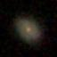
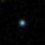

```{r setup, include=FALSE}
knitr::opts_chunk$set(warning = F, message = F, echo = F,
                      fig.height = 4)
```

# Astronomical Challange 
Our research focuses on classifying celestial objects into stars, galaxies or quasars using their spectral characteristics. With the advancement of astronomical technology, we can obtain a large amount of data, including images and spectral information, from telescopes and large-scale photometry.

The central question of our research is: "How can we effectively use image and spectral data to accurately classify different types of stellar objects?"


# Data
We plan to work with the astronomy dataset containing three types of data: 

1. Image of the celestial objects:

\quad  \quad  \quad  \quad  

\quad  \quad  \quad  \quad 

2. Image of the spectra of the celestial objects.

\quad {width=45%}

3. Metadata of the celestial objects, whose variables are as follows:

```{r results='asis'}
df = read.csv("./data/sdss_dr16_clean.csv")[,-20]
vars = colnames(df)
explanations = c("Object Identifier",
                 "Right Ascension angle (at J2000 epoch)",
                 "Declination angle (at J2000 epoch)",
                 "Ultraviolet filter",
                 "Green filter",
                 "Red filter",
                 "Near Infrared filter",
                 "Infrared filter",
                 "Run Number",
                 "Rerun Number",
                 "Camera column",
                 "Field number",
                 "Unique ID used for optical spectroscopic objects",
                 "Object class",
                 "Redshift value based on the increase in wavelength",
                 "Plate",
                 "Modified Julian Date",
                 "fiber ID",
                 "Plate ID")

tab_exp = data.frame(vars, explanations)

library(kableExtra)
names(tab_exp) <- sapply(names(tab_exp), function(x) paste0("\\textbf{\\normalsize ", x, "}"))

kable(tab_exp, format = "latex", 
      booktabs = TRUE,
      escape = F) %>%
  kable_styling(full_width = F, position = "left", font_size = 8)
```

They can be found in this [*\textcolor{blue}{link}*](https://github.com/siriuszza/stat679final/tree/main/data). All the data is obtained from https://www.sdss.org.

# EDA
First we will check and deal with missing values in the dataset. From figure 1 we can see that there are missing values for **i** and **z**. Then from figure 2, we can see that **i** and **z** are quite scattered. So, we use regression imputation to impute the missing values.

```{r}
df[df == -9999] = NA
```

```{r fig.cap="Missing Value Detection"}
library(VIM)
aggr(df, prop=FALSE, numbers=TRUE)
```

Next, we give several visualizations to better understand the data. Figure 3 gives the distribution of classes, which are 33333 samples each, as selected from the website to make sure the data set is balanced. 

\newpage

Figure 4 gives the spread of stellar across the universe. The x-axis is right ascension angle (at J2000 epoch), and the y-axis is declination angle (at J2000 epoch). We can see some interesting patterns, but it is unclear for classification.

Figure 5 gives the correlationship between varibales. There are some variables that have strong correlationships.

```{r fig.cap="Boxplot"}
library(tidyverse)
df_long = gather(df, key = "variable", value = "value", u, g, r, i, z, redshift) 

ggplot(df_long, aes(x = variable, y = value, col = class)) +
  geom_boxplot(alpha = 0.5) +
  labs(x = "Variable", y = "Value")
```

```{r}
library(mice)
df_num = df %>% 
  select(u, g, r, i, z, redshift)
imputed_data = mice(df_num, method = "norm.predict", m=1, maxit=10, print=F)
completed_data = complete(imputed_data)
df[, c(4:8, 15)] = completed_data
```


```{r fig.cap="Distribution of Classes", fig.height=3}
library(tidyverse)

ggplot(df) +
  geom_bar(aes(x = class, fill = class))
```

```{r fig.cap="Spread of Stellars"}
ggplot(df) +
  geom_point(aes(x = ra, y = dec, color = class),
             alpha = 0.025) + 
  labs(x = "Right Ascension",
       y = "Declination")+
  guides(color = guide_legend(override.aes = list(alpha = 1))) 
```

```{r fig.cap="Correlation"}
df = df %>%
  mutate(class = case_when(
    class == "STAR" ~ 1,
    class == "GALAXY" ~ 2,
    class == "QSO" ~ 3
  ))

library(corrplot)
corr = cor(df %>% select(-rerun))
corrplot(corr)
```


# Methods
We plan to employ both Deep Neural Networks (DNNs) and statistical models for object classification within the Sloan Digital Sky Survey (SDSS). For image classification, we have selected several DNN candidates based on their proven performance: ResNet, which supports very deep networks through its residual structure; VGG, which utilizes small-sized convolutional kernels (3x3) and pooling layers; and ResNeSt, which enhances the ResNet architecture by introducing a split-attention mechanism. 

Regarding statistical models, we intend to use either classification trees or logistic regression models, incorporating ensemble learning methods such as bagging or boosting to improve performance. Our ultimate goal is to develop a hybrid model that combines image classifiers with meta-classifiers, aiming for superior accuracy.

# Results


# Future Work
The next steps are clear. We will first finish the rest models: DNN for spectrum and classification model for metadata. Then, we will combine those three models with voting classifier to gain a better classification result.


