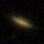
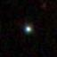
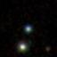

```{r setup, include=FALSE}
knitr::opts_chunk$set(warning = F, message = F, echo = F,
                      fig.height = 4)
```

# Astronomical Challange 
Our research focuses on classifying celestial objects into stars, galaxies or quasars using their spectral characteristics. With the advancement of astronomical technology, we can obtain a large amount of data, including images and spectral information, from telescopes and large-scale photometry.

The central question of our research is: "How can we effectively use image and spectral data to accurately classify different types of stellar objects?"

# Data
We plan to work with the astronomy dataset containing three types of data: 

1. Image of the celestial objects:

\quad  \quad  \quad  \quad 

2. Image of the spectra of the celestial objects.

\quad {width=45%}

3. Metadata of the celestial objects, whose variables are as follows:

```{r results='asis'}
df = read.csv("./data/sdss_dr16.csv")
vars = colnames(df)
explanations = c("Object Identifier",
                 "Right Ascension angle (at J2000 epoch)",
                 "Declination angle (at J2000 epoch)",
                 "Ultraviolet filter",
                 "Green filter",
                 "Red filter",
                 "Near Infrared filter",
                 "Infrared filter",
                 "Run Number",
                 "Rerun Number",
                 "Camera column",
                 "Field number",
                 "Unique ID used for optical spectroscopic objects",
                 "Object class",
                 "Redshift value based on the increase in wavelength",
                 "Plate",
                 "Modified Julian Date",
                 "fiber ID",
                 "Plate ID")

tab_exp = data.frame(vars, explanations)

library(kableExtra)
names(tab_exp) <- sapply(names(tab_exp), function(x) paste0("\\textbf{\\normalsize ", x, "}"))

kable(tab_exp, format = "latex", 
      booktabs = TRUE,
      escape = F) %>%
  kable_styling(full_width = F, position = "left", font_size = 8)
```


They can be found in this [*\textcolor{blue}{link}*](https://github.com/siriuszza/stat679final/tree/main/data).


# Methods
We plan to employ both Deep Neural Networks (DNNs) and statistical models for object classification within the Sloan Digital Sky Survey (SDSS). For image classification, we have selected several DNN candidates based on their proven performance: ResNet, which supports very deep networks through its residual structure; VGG, which utilizes small-sized convolutional kernels (3x3) and pooling layers; and ResNeSt, which enhances the ResNet architecture by introducing a split-attention mechanism. Regarding statistical models, we intend to use either classification trees or logistic regression models, incorporating ensemble learning methods such as bagging or boosting to improve performance. Our ultimate goal is to develop a hybrid model that combines image classifiers with meta-classifiers, aiming for superior accuracy.

# Contribution
The workload for this project will be equally distributed among us. We will collaboratively preprocess the data by merging and visualizing it. As outlined, one team member will be tasked with developing the statistical models, while another will focus on constructing and fine-tuning the DNN models. Following the training of these separate models, we will integrate their outcomes using techniques such as weighted averaging or regression to create a final model. This combined model is expected to achieve enhanced accuracy, leveraging the strengths of both deep learning and statistical approaches.

